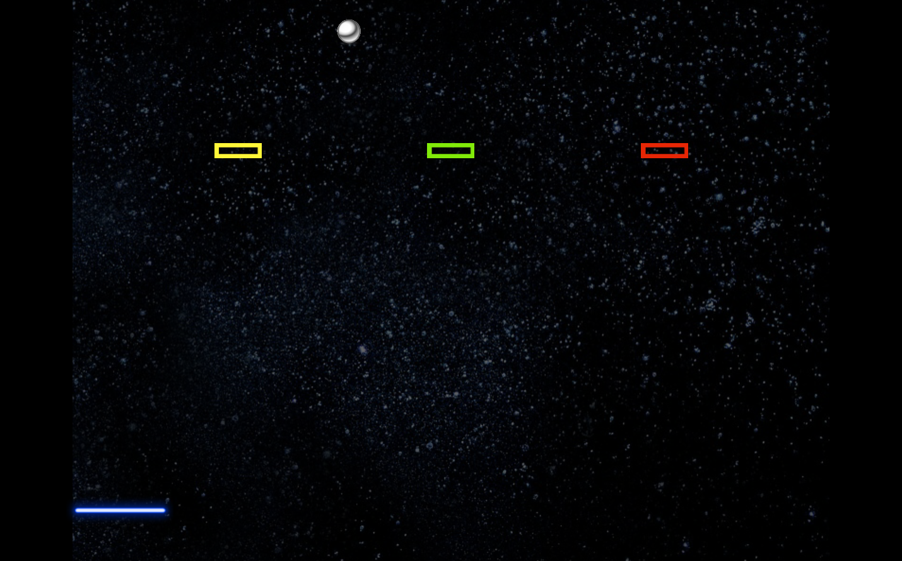

# Block Breaker

## Description

A take on the classic Breakout game. This is exercise 3 of the Udemy course [Learn to Code by Making Games](https://www.udemy.com/unitycourse/learn/v4/overview). Please refer
to the [game design document](BlockBreakerGDD.pdf) provided by the course instructors for more details.

## How to run
Clone the `Dist` folder, then run the application [BlockBreaker](BlockBreaker/Dist/BlockBreaker.exe), choose graphic settings, and click play!

## Screenshots

## Changelog

v0.2 [13/10] Published as standalone PC build.

v0.1 [24/09] Level progression done, music toggle bug
